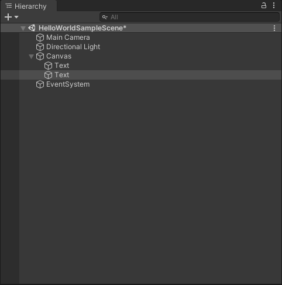
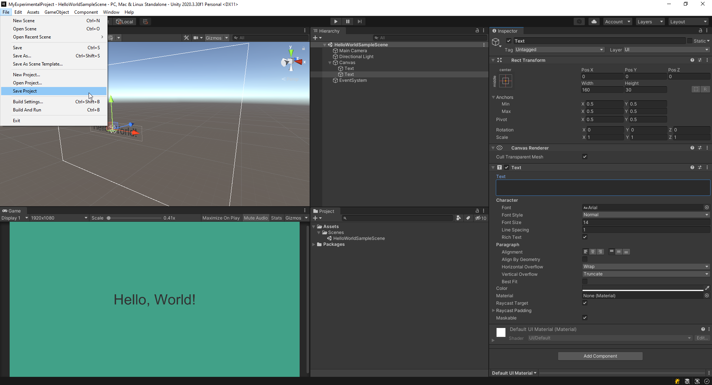
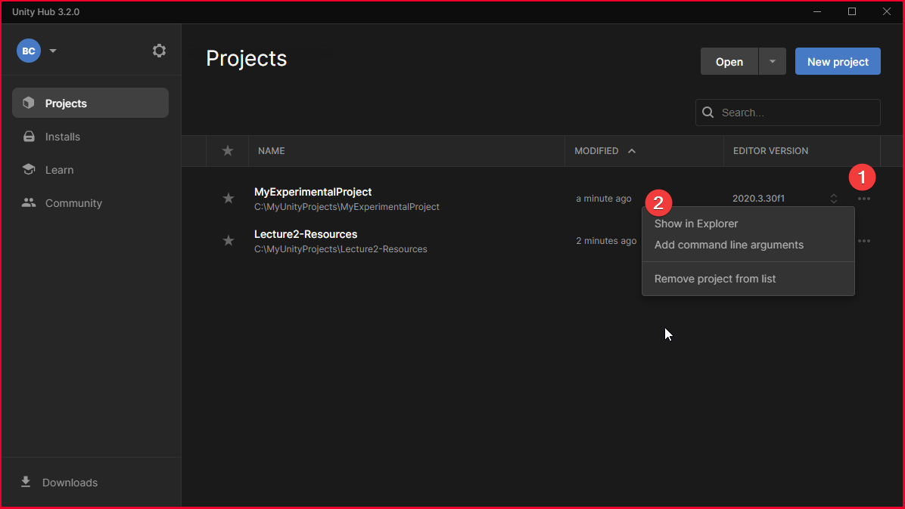
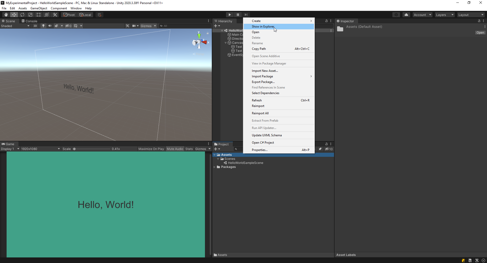
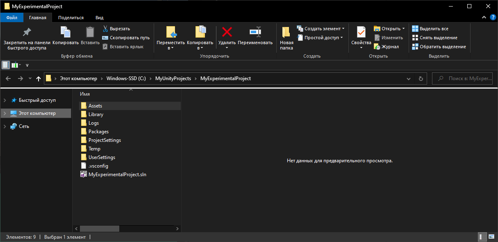
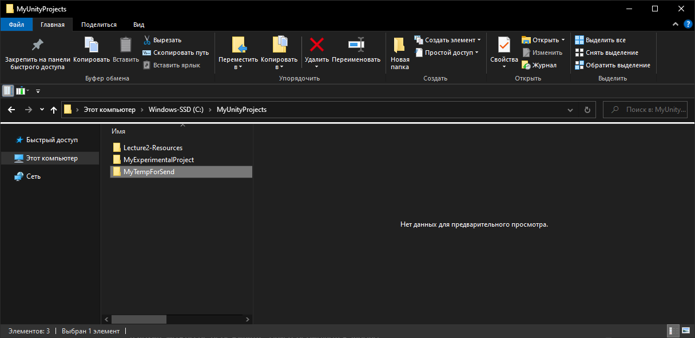
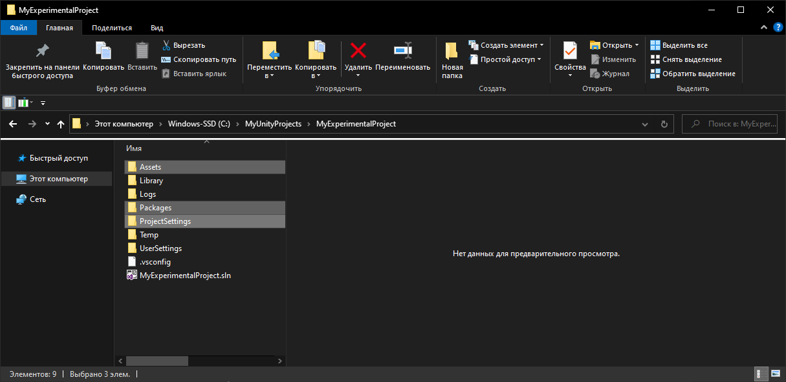
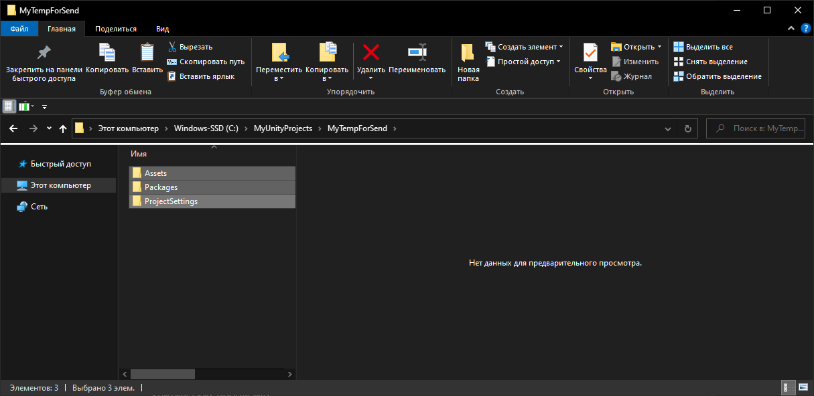
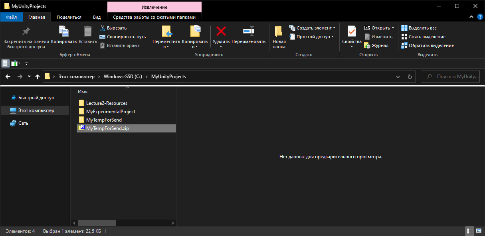

# Домашняя работа №3
## Домашнее задание.

- [X] `Повторить этапы пройденные на лекции.`
- [X] `Создать перемещаемую бочку (можно только толкать)`

## Самостоятельное выполнение этапов лекции

### Настройка окружения под себя

---

### Как отправить домашку:

1. **Перед экспортом проекта не забывайте сохранить весь проект вместе со всеми сценами!**

   a. Убедитесь, что рядом с именем сцены отсутствует звездочка.  
   **Сочетание клавиш:** `Ctrl + S` (Windows) или `Cmd + S` (Mac OS).  
   

   b. Далее выберите `File → Save Project`.  
   

   **Совет:** Сохраняйте сцену после создания каждого нового элемента или перед запуском приложения. Это очень важно! Unity, как и любая программа, может завершиться с ошибкой, или может произойти сбой в электропитании. Чтобы избежать потери данных, чаще сохраняйтесь (`Ctrl + S` / `Cmd + S`).

---

2. **Найдите проект, сохраненный на локальном диске.** Это можно сделать двумя способами:

   a. Через **Unity Hub**.  
   

   b. Через проект.
    - Нажмите правой кнопкой мыши на любом ресурсе из папки `Assets` или на самой папке `Assets`.  
      

    - Вы попадете в корень проекта.  
      

---

3. **Создайте временную папку для архивации проекта:**

   a. Перейдите на директорию выше и создайте новую пустую папку.  
   

   b. Скопируйте папки проекта, которые точно нужны: `Assets`, `Packages`, `Project Settings`.  
   

   c. Вставьте скопированные папки в созданную временную папку.  
   

   d. Архивируйте эту временную папку.  
   

---

4. **Отправьте архив через облако:**

    - Используйте удобное для вас облачное хранилище (Google Drive, Яндекс.Диск, Dropbox и т.д.).
    - Не забудьте открыть доступ для того, кто будет скачивать архив.
    - Отправьте ссылку на облако в форму для отправки домашнего задания.

---

### Зачем мы проделали такой путь?

- Этот способ ускоряет архивацию и разархивирование вашего проекта.
- Папки, не включенные в архив, не критичны — они генерируются заново.
- У вас останутся директории с промежуточными результатами, что позволит вернуться к предыдущим шагам разработки в случае проблем.
- Это альтернатива системе контроля версий Git.

---

### Удачи!

---

### Обратите внимание:

- Задать вопросы проверяющему можно прямо на платформе в процессе сдачи домашнего задания.
- Не стесняйтесь обращаться за помощью к сообществу в канал **"стрёмные-вопросы"** вашего курса.
    - Если вас ещё нет в чате, нажмите голубую кнопку **"Перейти"** на главной странице курса.
    - Если ответ не найден по ключевым словам или сообщество не знает ответа, адресуйте вопрос эксперту курса, упомянув его в сообщении.

---

### Кого отмечать в сообщении?

- В закрепленном сообщении чата **"Стрёмные вопросы"** вы найдете актуальные контакты экспертов курса.
- Если вы уже сдавали домашние задания и получали фидбек от проверяющего, упомяните его.

---

### Рекомендации:

- Мы настоятельно рекомендуем обращаться к специалистам именно в курсовых чатах.
    - Ваш вопрос увидят все участники курса: студенты могут ответить быстрее, чем эксперт.
    - Ответ на ваш вопрос может помочь другим студентам.
    - Мы сможем проконтролировать соблюдение правил сервера и обеспечить комфортное общение.

---

**Успехов в выполнении домашнего задания!** 🚀
